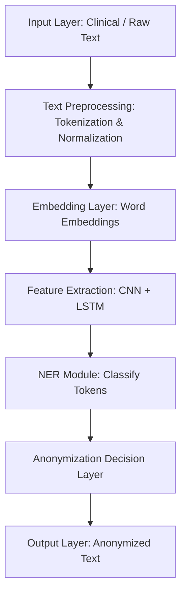

```mermaid
graph TD
    A[Input Layer: Clinical / Raw Text] --> B[Text Preprocessing: Tokenization & Normalization]
    B --> C[Embedding Layer: Word Embeddings]
    C --> D[Feature Extraction: CNN + LSTM]
    D --> E[NER Module: Classify Tokens]
    E --> F[Anonymization Decision Layer]
    F --> G[Output Layer: Anonymized Text]

```
